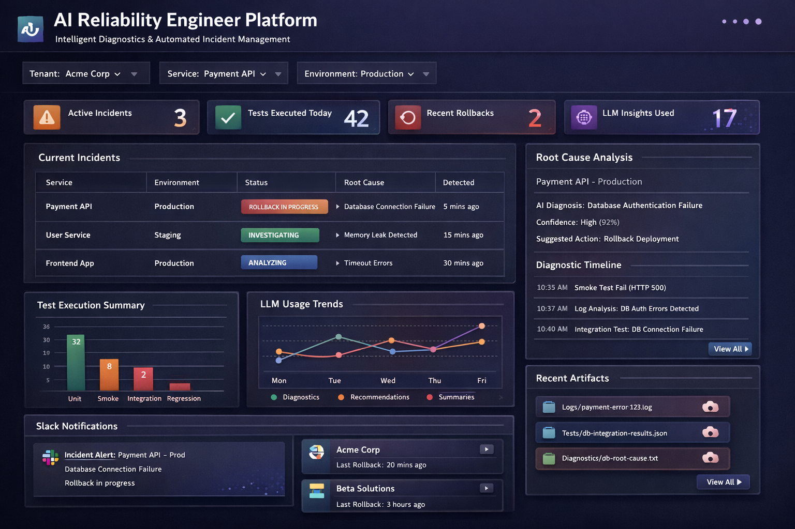

# SRE Agent  Ephemeral ECS Debugging Agent



An AI-powered debugging agent that runs as a short-lived ECS task per deployment. It gathers data from CloudWatch and other AWS APIs, reasons over it with Amazon Bedrock (Claude), and stores all artifacts to S3. The local cache is ephemeral  when the container restarts, memory is cleared.

## Architecture

```
GitHub Actions
  -> EventBridge (repo, commit SHA, service, environment)
    -> ECS Task (one task per deployment event)
         Fetches CloudWatch logs + ECS status
         Caches data locally on ephemeral ECS storage (/data/cache)
         Sends context to Amazon Bedrock (Claude) for reasoning
         Records all shell commands + AWS tool calls
         Flushes artifacts to S3 on completion:
           s3://{bucket}/investigations/{repo}/{commit_short}/
         API + UI remain up after investigation completes
```

**Single container, single ECS task**  the API (FastAPI), agent investigator, and UI (Next.js static export) all run inside one image. The entrypoint starts the API in the background, runs the investigation, then keeps the API serving so the UI can display results.

## Quickstart (Docker / local dev)

Prereqs: Docker Desktop with Compose.

```bash
docker compose up --build
```

- **Dashboard**: `http://localhost:8000` (UI served by FastAPI as static files)
- **API health**: `http://localhost:8000/healthz`
- **LocalStack S3**: `http://localhost:4566` (local S3 substitute)

The agent runs immediately using the `GITHUB_REPO` / `COMMIT_SHA` env vars set in `docker-compose.yml`. S3 artifacts are written to LocalStack.

## S3 Artifact Structure

```
s3://{bucket}/investigations/{github_repo}/{commit_short}/
  session.json          <- session metadata (started_at, repo, commit, service, env)
  summary.json          <- final investigation summary (root cause, confidence)
  logs/
    {log_group}.jsonl   <- raw CloudWatch log events
  commands/
    history.jsonl       <- shell commands + AWS API tool call history
  ai/
    reasoning.jsonl     <- per-turn Bedrock messages
    rca.md              <- root cause analysis (markdown)
  artifacts/
    {name}              <- any additional investigation artifacts
```

## Local Cache

While an investigation is running, all data is written to `/data/cache/{session_id}/` (same layout as S3). The cache has a 6-hour TTL  stale sessions are swept hourly by the API. The volume is ephemeral; restarting the container clears it.

## API Endpoints

| Method | Endpoint | Description |
|--------|----------|-------------|
| GET | /healthz | Health check |
| GET | /v1/sessions | List sessions (cache + S3), optional ?status=investigating |
| GET | /v1/sessions/{id} | Session detail + summary |
| GET | /v1/sessions/{id}/commands | Full command + tool call history |
| GET | /v1/sessions/{id}/reasoning | Bedrock reasoning turns |
| GET | /v1/sessions/{id}/artifacts | List artifact filenames |
| GET | /v1/sessions/{id}/artifacts/{filename}/download | Download artifact |
| GET | /v1/dashboard/summary | Aggregate KPIs |

## Local UI Development

The UI is built to static files during the Docker image build (`next build` with `output: export`). For iterative frontend development without rebuilding the image:

```bash
cd ui
npm install
npm run dev    # http://localhost:3000 -- proxies API calls to localhost:8000
```

`ui/.env.local` is pre-configured with `NEXT_PUBLIC_API_BASE=http://localhost:8000`.

## Configuration

All configuration is via environment variables:

| Variable | Default | Description |
|----------|---------|-------------|
| GITHUB_REPO | unknown/unknown | Repository name (e.g. myorg/my-service) |
| COMMIT_SHA | 0000... | Full commit SHA from EventBridge |
| SERVICE_NAME | unknown | ECS service name being investigated |
| ENVIRONMENT | production | Deployment environment |
| S3_BUCKET | sre-agent-investigations | S3 bucket for artifacts |
| S3_PREFIX | investigations | S3 key prefix |
| S3_REGION | us-east-1 | AWS region for S3 |
| BEDROCK_REGION | us-east-1 | AWS region for Bedrock |
| BEDROCK_MODEL | anthropic.claude-3-5-sonnet-20241022-v2:0 | Bedrock model ID |
| CACHE_DIR | /data/cache | Local ephemeral cache path |
| CACHE_TTL_HOURS | 6 | Hours before cache sessions are swept |
| AWS_ENDPOINT_URL | (none) | Override for LocalStack (http://localstack:4566) |

## ECS / Production Deployment

See [docs/ecs-migration.md](docs/ecs-migration.md) for the full ECS deployment design including IAM roles, EventBridge trigger pattern, and task definition.
